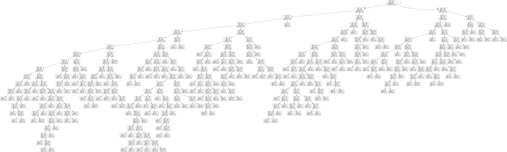

# ⚔️ Game of Thrones Character Death Prediction

## 📌 專案簡介
本專案以《Game of Thrones》小說角色資料為基礎，運用機器學習技術預測角色是否會死亡。透過資料清洗、特徵工程與分類模型（Decision Tree Classifier）分析角色生存關鍵，並以決策樹圖形化展示預測邏輯，增強模型可解釋性。

## 🔧 使用技術
- Python (Pandas)
- 機器學習：Scikit-learn (tree.DecisionTreeClassifier, metrics)
- Pydotplus（決策樹圖形化）
- Graphviz（決策樹圖輸出）

## 💻Project Source Codes:
[Game of Thrones Character Death Prediction](https://github.com/thegloriachen/Game-of-Thrones-Character-Death-Prediction/blob/main/Game%20of%20Thrones%20Character%20Death%20Prediction.py)

## 🚀 專案流程說明

### 1️⃣ 資料讀取與初步處理
- 讀取 `character-deaths.csv` 資料集  
- 缺失值處理：
  - 書籍章節、死亡年份等缺失資料以 `0` 補值  
- 特徵欄位編碼處理：
  - `Death Year`、`Book of Death`、`Death Chapter` 轉為二元欄位  
  - `Allegiances` 欄位採用 One-hot Encoding 進行數值轉換
    
### 2️⃣ 特徵與標籤分離
- **Features（自變數）：** 書籍章節、家族勢力、書籍出場等特徵  
- **Label（目標變數）：** `Death Year` ➜ 是否死亡（0=生、1=死）

### 3️⃣ 訓練與測試集劃分
- 使用 `train_test_split()`，將資料劃分為訓練集（75%）與測試集（25%）

### 4️⃣ 模型建置與訓練
- 建立 `DecisionTreeClassifier`  
  - 參數設定：
    - `max_depth=20`（限制樹的深度，避免過擬合）
    - `random_state=0`（確保結果可重現）
- 執行 `fit()` 進行模型訓練

### 5️⃣ 預測與模型評估
- 預測測試集資料 ➜ `predict()`  
- 模型評估指標：
  - 混淆矩陣（Confusion Matrix）
  - 分類報告（Classification Report：Precision、Recall、F1-Score）
  - 準確率（Accuracy）

### 6️⃣ 決策樹視覺化
- 使用 `export_graphviz()` 產生 DOT 格式  
- 透過 `pydotplus` 輸出 PNG 圖檔  
- 圖片檔案為：`decision_tree.png`

## 📈 模型表現
| 評估指標        | 數值                 |
|----------------|----------------------|
| Precision      | 51.85%  
| Recall         | 61.76%  
| Accuracy       | 71.74%  

## 🌳 決策樹視覺化
> 以下為本次預測模型的決策樹範例（Graphviz 輸出）

